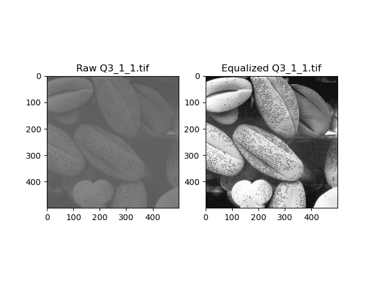
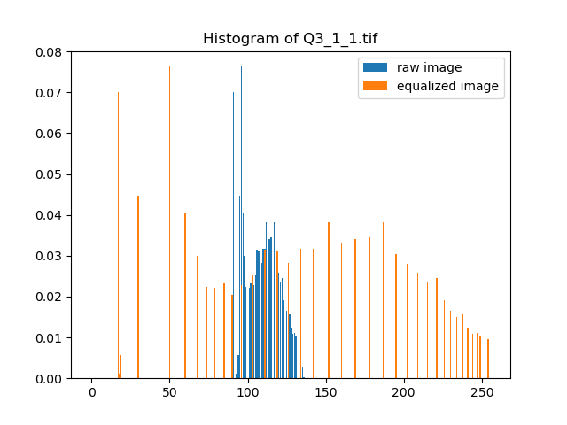
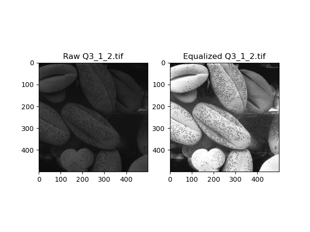
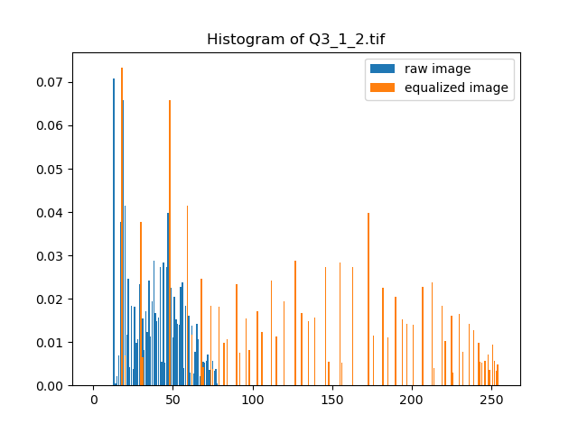

# The Report for Digital Image Processing Laboratory 2

This report is contributed by HUANG Guanchao, SID 11912309, from SME. The complete resources of this laboratory, including source code, figures and report in both `.md` and `.pdf` format can be retrieved at [my GitHub repo](https://github.com/kommunium/dip-lab)

[toc]

---

## Introduction

*Histogram* is a statistical property of a digital image, symbolizing the distributions of pixels of different intensity levels. Histogram is defined as $h(r_k) = n_k$, in which $r_k$ is the $k$th intensity value, $n_k$ is the number of pixels in the image with intensity $r_k$. A generalized concept is *normalized histogram*

Image histograms are present on many modern digital cameras. Photographers can use them as an aid to show the distribution of tones captured, and whether image detail has been lost to blown-out highlights or blacked-out shadows. This is less useful when using a raw image format, as the dynamic range of the displayed image may only be an approximation to that in the raw file.[^Wiki].

[^Wiki]: See wikipedia *image histogram*

Histogram offers a quantitative rubric for the contrast of an image, namely a well-enhanced image should have evenly distributed histogram in most of the cases, which also provides a methodology for image enhancing.

This lab session is mainly about the utilities of histogram in digital images enhancement. Histogram equalization, histogram matching and local histogram equalization are implemented with `Python` and the results of which are compared.

<!-- TODO further descriptions for various methods -->

This lab session also contains utilizing median smoothing to reduce salt-and-pepper noise, which presents better result than simple average smoothing.

---

## Histogram Equalization

A general way to enhance the contrast of a digital image is histogram equalization, which maps the intensity levels in the raw images to another set of grey scales to form evenly distributed histogram.

### Methodology for Histogram Equalization

The intensity levels in an image may be viewed as random variables in the interval $[0, L-1]$. Let $p_r(r)$ and $p_s(s)$ denote the probability density function (PDF) of random variables $r$ and $s$. Hence, we have the relation

$$
p_s(s) = p_r(r)\left|\frac{dr}{ds}\right|.
$$

Based on which, a transformation function of particular importance in image processing can be formed as

$$
s = T(r) = (L - 1)\int_0^r p_r(w)\mathop{dw}.
$$

To verify this transformation, examining the PDF.

$$
\begin{aligned} &
\frac{ds}{dr} =
\frac{dT(r)}{dr} =
(L-1)\frac{d}{dr} \int_0^r p_r(w)\mathop{dw} =
(L-1)p_r(r) \\ \Rightarrow &
p_s(s) =
\frac{p_r(r)\mathop{dr}}{ds} =
\frac{p_r(r)}{ds/dr} =
\frac{p_r(r)}{(L - 1)p_r(r)} =
\frac{1}{L - 1}
\end{aligned}
$$

Which is a constant, and exactly the even distribution. Similarly, the corresponding transformation in discrete case is expressed in forms of summation.

$$
s_k =
T(r_k) =
(L - 1) \sum_{j=0}^k p_r(r_j) =
(L - 1) \sum_{j=0}^k \frac{n_j}{MN} =
\frac{L-1}{MN} \sum_{j=0}^k n_j
$$

In which, $k = 0, 1, \dots, L-1$.

### `Python` Implementation for Histogram Equalization

The total process can be implemented within less than 10 lines of code, which is also straightforward.

```python
def hist_equ(in_image: np.ndarray):

    L = 2 ** 8
    bins = range(L + 1)

    in_hist, _ = np.histogram(in_img.flat, bins=bins, density=True)
    s = np.array([(L - 1) * sum(in_hist[:k + 1]) for k in range(L)])

    out_img = np.array([s[r] for r in in_img], int).reshape(in_img.shape)
    out_hist, _ = np.histogram(out_img.flat, bins=bins, density=True)

    return out_img, out_hist, in_hist
```

### Results of Histogram Equalization

The result of histogram equalization for `Q3_1_1.tif` is shown below. It is obvious that the dynamic range of the image is prominently enhanced.



It is also clear that, the histogram of the enhanced image distributes over a much wider range.



The histogram equalization also had excellent effects on image `Q3_1_2.tif`, which is darker than `Q3_1_1.tif`, but the result is also striking.





However, though the visual effects of equalized images became better, they are noticeably less smooth than the raw images. This result is natural since for `Q3_1_1.tif`, 42 grey-scale levels were reduced to 39, and for `Q3_1_2.tif`, 70 were reduced to 62, but the grey-scales are distributed in a larger range within $[0, 255]$. In the original images, pixels are grouped in a small range of grey-scales, therefore seems to be smoother.

---

## Histogram Matching

Histogram equalization is not suitable for all cases, and sometimes *histogram matching*, which is a superset of histogram equalization.

### Methodology for Histogram Matching

Similar to histogram equalization, first specify the equalized transformation $s$.

$$
s = T(r) = (L - 1)\int_0^r p_r(w)\mathop{dw}
$$

Then, $s$ is considered as an intermediate variable, the specified histogram $z$ satisfies

$$
G(z) = (L - 1)\int_0^r p_r(w)\mathop{dw} = s.
$$

That is, the equalizing transformation for both the raw histogram and the target histogram should be identical. Based on which we may form the mapping from $s$ to $k$, hence the mapping from $r$ to $z$ can be further obtained.

$$
z = G^{-1}(s) = G^{-1}[T(r)]
$$

The transformation for discrete cases is similar.

$$
\begin{cases}\displaystyle
s_k =
T(r_k) =
(L - 1) \sum_{j=0}^k p_r(r_j) =
\frac{L-1}{MN} \sum_{j=0}^k n_j \\ \displaystyle
G(z_q) =
(L-1) \sum_{i=0}^q p_z(r_j) =
s_k
\end{cases}\Rightarrow
z_q = G^{-1}(s_k)
$$

### `Python` Implementation for Histogram Matching

```python
def hist_match(in_img: np.ndarray, spec_hist):

    L = 2 ** 8
    bins = range(L + 1)
    in_hist, _ = np.histogram(in_img.flat, bins=bins, density=True)
    
    s = np.array([(L - 1) * sum(in_hist[:k + 1]) for k in range(L)], int)
    g = np.array([(L - 1) * sum(spec_hist[:q + 1]) for q in range(L)], int)
    z = np.array([np.where(g == e)[0][0] if len(np.where(g == e)[0]) != 0 else 0 for e in s], int)

    out_img = np.array([z[r] for r in in_img], int).reshape(in_img.shape)
    out_hist, _ = np.histogram(out_img.flat, bins=bins, density=True)

    return out_img, out_hist, in_hist
```

---

## Local Histogram Equalization

---
