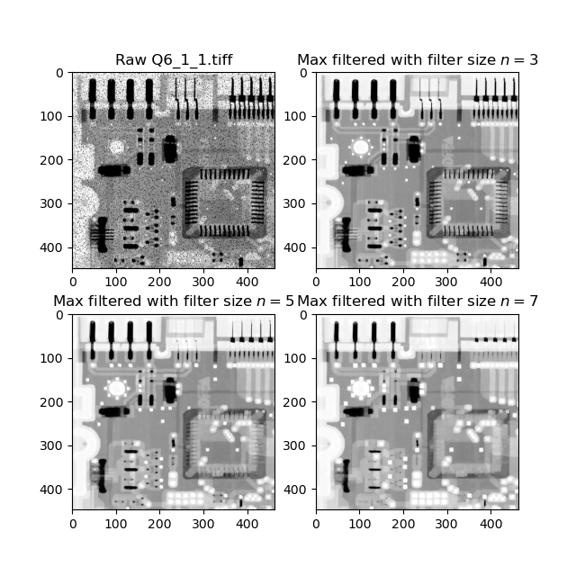
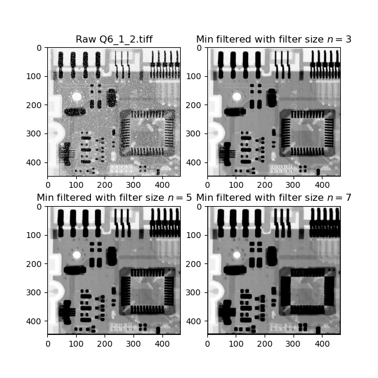
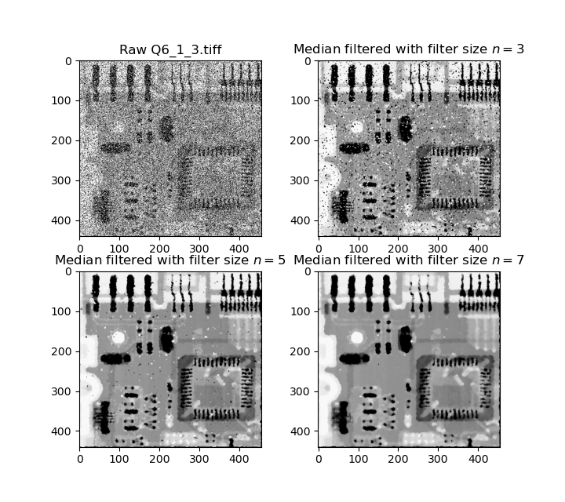
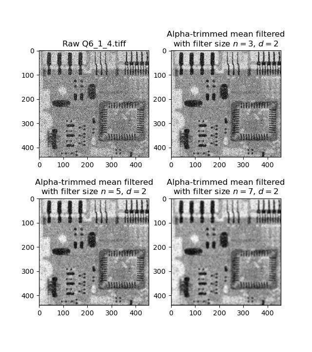
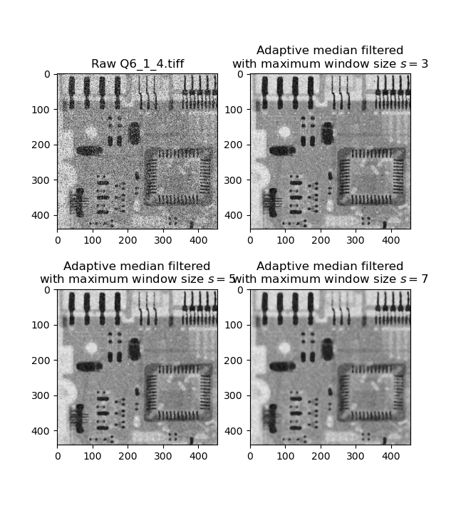

# The Report for Digital Image Processing Laboratory 5

This report is contributed by HUANG Guanchao, SID 11912309, from SME. The complete resources of this laboratory, including source code, figures and report in both `.md` and `.pdf` format can be retrieved at [my GitHub repo](https://github.com/kommunium/dip-lab)

[toc]

---

## Image Denoising

### Remove Pepper-Noise for `Q6_1_1.tiff`

It can be easily discovered that, the image is polluted by **pepper noise**, namely many "black" pixels with low intensity. In the presence of pepper noise, **max filtering** may have good effect. The filter is defined mathematically as follows:

$$
\hat{f}(x,\, y) =
\max\limits_{(s,\, t)\in S_{xy}}
\{g(s,\, t)\}
$$

```python
def max_filter(img_raw, n: int = 3):
    m = (n - 1) // 2
    row, col = img_raw.shape
    img_pad = np.pad(img_raw, m)
    img_out = np.array([img_pad[i:i + n, j:j + n].max()
                        for i in range(row)
                        for j in range(col)]).reshape(row, col)
    return img_out
```

For larger filter size, more details are lost, and thus setting filter size to be `n = 3` is satisfying.



### Remove Salt-Noise for `Q6_1_2.tiff`

Similar to `Q6_1_1.tiff`, the image is polluted by **salt noise** instead, namely many "bright" pixels with high intensity. In the presence of salt noise, **min filtering** may have good effect.  The filter is defined mathematically as follows:

$$
\hat{f}(x,\, y) =
\min\limits_{(s,\, t)\in S_{xy}}
\{g(s,\, t)\}
$$

```python
def min_filter(img_raw, n: int = 3):
    m = (n - 1) // 2
    row, col = img_raw.shape
    img_pad = np.pad(img_raw, m)
    img_out = np.array([img_pad[i:i + n, j:j + n].min()
                        for i in range(row)
                        for j in range(col)]).reshape(row, col)
    return img_out
```

For larger filter size, more details are lost, and the dark areas become larger due to min filtering. Thus, setting filter size to be `n = 3` is proper.



### Remove Salt-and-Pepper Noise for `Q6_1_3.tiff`

By observing both the dark and bright regions of the image, we may discover that the image is polluted by **salt-and-pepper noise**. In the presence of which, **median filtering** may have good effect.  The filter is defined mathematically as follows:

$$
\hat{f}(x,\, y) =
\mathop{\text{median}}\limits_{(s,\, t)\in S_{xy}}
\left\{g(s,\, t)\right\}
$$

```python
def median_filter(img_raw, n: int = 3):
    m = (n - 1) // 2
    row, col = img_raw.shape
    img_pad = np.pad(img_raw, m)
    img_out = np.array([np.median(img_pad[i:i + n, j:j + n])
                        for i in range(row)
                        for j in range(col)]).reshape(row, col)
    return img_out
```

For larger filter size, more details could be lost. The smallest filter size to achieve satisfying filtering result is `n = 7`.



### Remove the Combined Noise in `Q6_1_4.tiff`

From observation, we may found that the noise in `Q6_1_4.tiff` is the combination of salt-and-paper and other specific type of noise.

#### Multiple Median Filtering

One possible way for dealing with complex noise is by multiple median filtering.

```python
Q6_1_4_1 = median_filter(Q6_1_4)
Q6_1_4_2 = median_filter(Q6_1_4_1)
Q6_1_4_3 = median_filter(Q6_1_4_2)
Q6_1_4_4 = median_filter(Q6_1_4_3)
```

The result for various iterations of median filtering is shown below.


Though the image looks better than its raw, the result is still not satisfying enough.

#### Alpha-Trimmed Filtering

For combined noise, alpha-trimmed filtering is also another option. The filter is mathematically defined as follows.

$$
\hat{f}(x,\, y) =
\frac{1}{mn - d} \sum_{(s,\, t)\in S_{xy}} g_r(s, t)
$$

We delete the $d/2$ lowest and the $d/2$ highest intensity values of $(g,\, t)$ in the neighborhood $S_{xy}$. Let $g_r(s,\, t)$ represent the remaining $mn - d$ pixels.

```python
def alpha_filter(img_raw, n: int = 3, d=0.1):
    m = (n - 1) // 2
    trimmed = max(int(d * n ** 2), 1)
    row, col = img_raw.shape
    img_pad = np.pad(img_raw, m)

    img_out = np.array([np.mean(np.sort(img_pad[i:i + n, j:j + n].flat)[trimmed:-trimmed])
                        for i in range(row)
                        for j in range(col)])

    return img_out.astype(np.uint8).reshape(row, col)
```

First consider different filter size, `d` is by default `0.1`, that is, the maximum and minimum $10\%$ of pixels in the window is excluded from averaging. The result comparison is shown below.



Similar to other methods used before, larger filter size introduces greater blurriness, only `n=3` is acceptable. Based on this, the comparison of different `d` is shown below.


Again, though the image looks better than its raw, the result is still not satisfying enough.

#### Adaptive Median Filtering

Adaptive filtering may have good effect in some cases, and here try using adaptive median filtering, which works in two stages given below.

The behavior of spatial adaptive filter changes based on statistical characteristics of the image inside the filter region defined by the $m\times n$ rectangular window. The performance is superior to common filters discussed before.

Firstly, $S_{xy}$ is the local region, and some notations are predefined.

|    Notation    |                 Meaning                 |
| :------------: | :-------------------------------------: |
| $z_\text{min}$ |   minimum intensity value in $S_{xy}$   |
| $z_\text{max}$ |   maximum intensity value in $S_{xy}$   |
| $z_\text{med}$ |   median intensity value in $S_{xy}$    |
|    $z_{xy}$    | intensity value at coordinates $(x, y)$ |
| $S_\text{max}$ |    maximum allowed size of $S_{xy}$     |

- *Stage A*
  >To determine if the median value is an impulse or not.
  - Define $A_1 = z_\text{med} - z_\text{min}$, $A_2 = z_\text{med} - z_\text{max}$.
  - If $A_1 > 0$ and $A_2 < 0$, go to *Stage B*;
  - Else increase the window size.
  - If window size is less or equal to $S_\text{max}$, repeat *Stage A*;
  - Else output $z_\text{med}$.
- *Stage B*
  >To determine if the processed point is an impulse or not.
  - Define $B_1 = z_{xy} - z_\text{min}$, $B_2 = z_{xy} - z_\text{max}$.
  - If $B_1 > 0$ and $B_2 < 0$, output $z_{xy}$;
  - Else output $z_\text{med}$.

```mermaid
flowchart TB
    A[Stage A]
    B[Stage B]
    J[[Judgment]]

    A --> J
    J --> A
    A --> B
    B --> B1(Zxy)
    B --> B2(Zmed)

    J --> A1(Zmed)
```

>The `Python` implementation of adaptive filtering is rather more complicated than methods used before, hence the code is concisely.

At the beginning of the function, obtain the dimension of the image, and initialize the window size. For the purpose of convenience, the default window size is set to be `n = 1`, namely a single pixel. Also, instantiate an empty array for storing the result.

```python
# start from window size of one, that is the pixel itself
row, col = img_raw.shape
img_out = np.zeros((row, col))
```

A separate function `window()` for obtaining the window is implemented. For invalid window, namely out of bound or exceeding the maximum window size, the function would return `None`.

>Due to the `namespace` concept in `Python`, a function is able to access any variables in its parent `namespace`s, and therefore there is no need for passing other parameters.

```python
def window():
    """
    :return: if out of bound or reaching the , return None, if not return the window
    """
    if i - m >= 0 and i + m <= row and j - m >= 0 and j + m <= col and n <= s:
        return img_raw[i - m:i + m + 1, j - m:j + m + 1]
```

Do filtering within `for` loop.

```python
for i in range(row):
    for j in range(col):
        ...
```

In each iteration, first initialize the window and the value used in Stage A. Functions `np.median()`, `np.min` and `np.max()` are also valid for a single value.

```python
# initialize the window and the values in stage A, by initialization the window is single pixel
n = 1
m = (n - 1) // 2

img_tmp = window()
a1 = np.median(img_tmp) - np.min(img_tmp)
a2 = np.median(img_tmp) - np.max(img_tmp)
```

At the start of each iteration, the window contains only one pixel, and therefore `a1 = a2 = 0`, the algorithm would enter Stage A, a `while` loop here, definitely. In each iteration of the loop, it is first verified that the window is valid, that is, to make sure the window size does not exceed its maximum `s`, and also no out of bound exception occurs. Judgment is also made to make sure that Stage B is not available yet.

>For the purpose of convenience, padding is not implemented here in adaptive filtering.

```python
# while the window is valid and the requirement tof going stage B is not satisfied, keep looping in stage A
while img_tmp is not None and not (a1 > 0 and a2 < 0):
    n += 2
    m = (n - 1) // 2
    img_tmp = window()
```

In each iteration of the `while` loop, namely Stage A, the window size and the window `img_tmp` is updated. Once the prerequisites are no more satisfied, the loop is exited. Further process is still based on valid window, so it is needed to recover the window to its previous status.

```python
# when out of bound, or reaching the maximum windows size, or stage B is available
# recover the window size to the last one
n -= 2
m = (n - 1) // 2
img_tmp = window()  # get the window
```

Since there is more than one case that cause the `while` loop to exit, after the recovery, we need to justify again why the Stage A `while` loop is exited. If the condition for Stage B is satisfied, the exit is due to the jump to Stage B.

```python
if a1 > 0 and a2 < 0:  # when stage B is available
    b1 = img_raw[i, j] - np.min(img_tmp)
    b2 = img_raw[i, j] - np.max(img_tmp)
    if b1 > 0 and b2 < 0:
        img_out[i, j] = img_raw[i, j]
```

If not, the exit is due to invalid window size, including out of bound of reaching the maximum size.

```python
# another possible case is combined below
else:  # stage B is not available, the exit of while loop is due to reaching the max possible window size
    img_out[i, j] = np.median(img_tmp)
```

Note that, the implicit case in Stage B for taking `img_out[i, j] = np.median(img_tmp)` is combined in the final `else` block.

In a new iteration, the window size is reload automatically. Finally, return the result.

```python
return img_out.astype(np.uint8)
```

The result of adaptive median filtering is shown below.



The final result is largely improved with adaptive filtering.

---

## Image Restoration

---

## Bonus: Image Restoration
